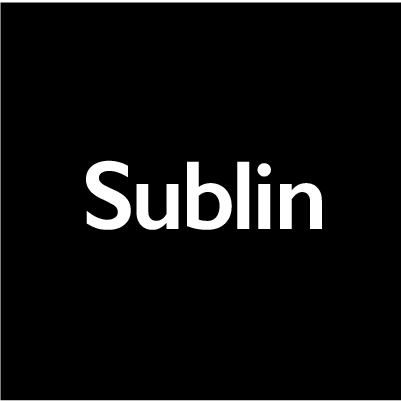
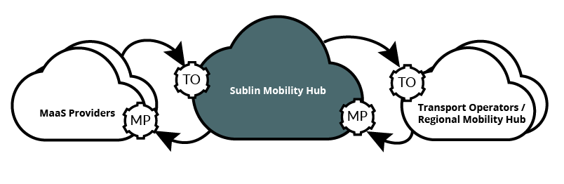
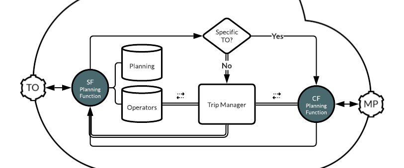
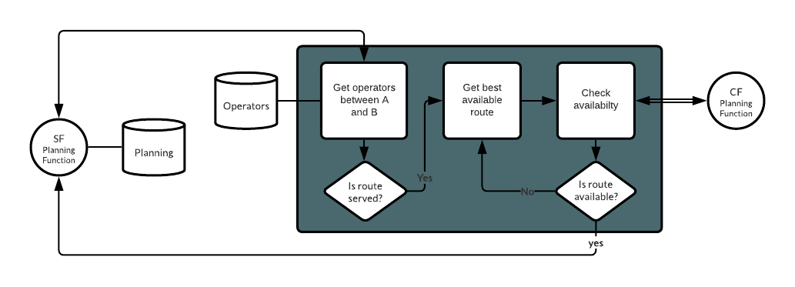
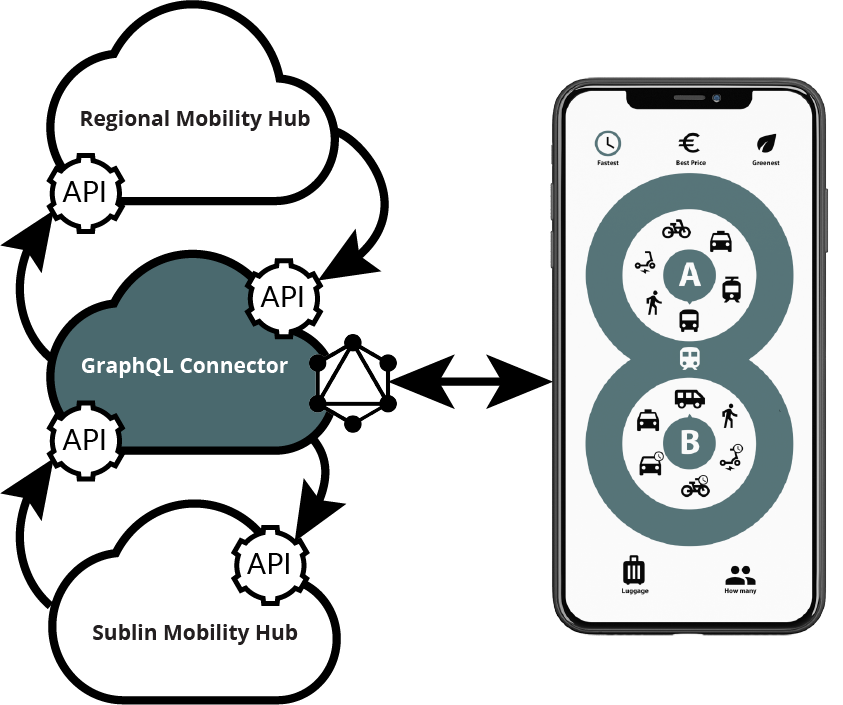

 

# Digital Mobility Hub

## Prototype
The Sublin project started with the development of a Firebase based prototype. It is based on Firebase using Firestore. The corresponding prototype app can be found in the repo [https://github.com/schadauer/Sublin]. All functions are Firebase-triggered. [A demo video](https://youtu.be/fUwMlH78LVI) about the user experience of the app for a better understanding about the underlying functionalities is available [here](https://youtu.be/fUwMlH78LVI).

Firebase is only used as an interim solution and will be replaced by a provider agnostic solution outlined below. At the moment functions are triggered by database changes. Moving forward functions will be triggered by API calls.

#####So the above is where we are and the below is where we are heading towards 🚀.

## Goal
General information to the Sublin mobility hub can be found on the project website [www.sublin.dev](https://www.sublin.dev/development). The mobility hub accumulates transport operators and it makes them available via a single API to MaaS providers or other Sublin mobility hubs.

The Sublin mobility hub consists of the following components:
- The REST API server in sync with the [TOMP API](https://app.swaggerhub.com/apis/TOMP-API-WG/transport-operator_maas_provider_api/) specification
- API functions
- NoSQL database
- Trip manager
- Authentication and authorization (users are not included)
- GraphQL server with REST API resolver

### The API defined by TOMP-WG
The API defines both sides - endpoints for the MP (MaaS-Provider) and the TO (Transport Operators). The OpenApi documentation for the endpoints can be [here](https://app.swaggerhub.com/apis/TOMP-API-WG/transport-operator_maas_provider_api/). The Sublin mobility hub provides two modes depending on the URL-requests. MPs can either 
- request a service of a specific TO by providing the TO-id after the hub domain ([mobility hub domain]/[TO id]/[endpoint])
- or a full intermodal route by calling the endpoints without the TO-id ([mobility hub domain]/[endpoint]).

### API functions
The API functions consist of server functions (SF) and client functions (CF). Server functions are callback functions that are triggered by API TO endpoint calls which can then execute another SF function or the trip manager if it is not a direct call to a specific TO. SF and the trip manager can then execute CFs which call TO API endpoints from transport operators or other mobility hubs.

### NoSQL database
The mobility hub handles primarily JSON data sets. This is the reason why have chosen to use a noSQL database as the default database type.

### Trip manager
The trip manager aggregates all TOs and generates the best possible intermodal route with all registered TOs. Depending on the business model of the hub the route can consist of independent TOs with separate billing or alternatively it can operate as a single contracting body with the TOs as sub operators. The trip manager combines scheduled public with on-demand transport. Intermodal routes do not include legs which require private transportation. If this is required by MaaS services it needs to be added on their part. However it can include services from private carpools that are made available as a TO.

### Authentication and authorization
Authentication and authorization is only limited to applications like connecting two hubs or connecting hubs with TO or MP applications. End user authentication and authorization needs to be handled by the MP. We use OAuth 2.0 as a method to combine authentication with authorization.

### GraphQL connector
The GraphQL connector GraphQL clients to connect with the mobility hub as both as a MP and a TO. This allows applications like apps to connect with minimal overhead and subscribe to events.

The Sublin project also develops an open-source white label app that connects with the hub as an MP as well as an TO. It serves as a reference implementation and it can be used as white label solutions for MPs and TOs alike. As it is developed under the MIT license it can set the foundation for other open-source or proprietary solutions.

# Technology stack
The Sublin mobility hub is developed with the following main technolgies:
- JS/Typescript
- Nodejs
- MongoDB
- REST API
- GraphQL
- OAuth 2.0

# License
MIT